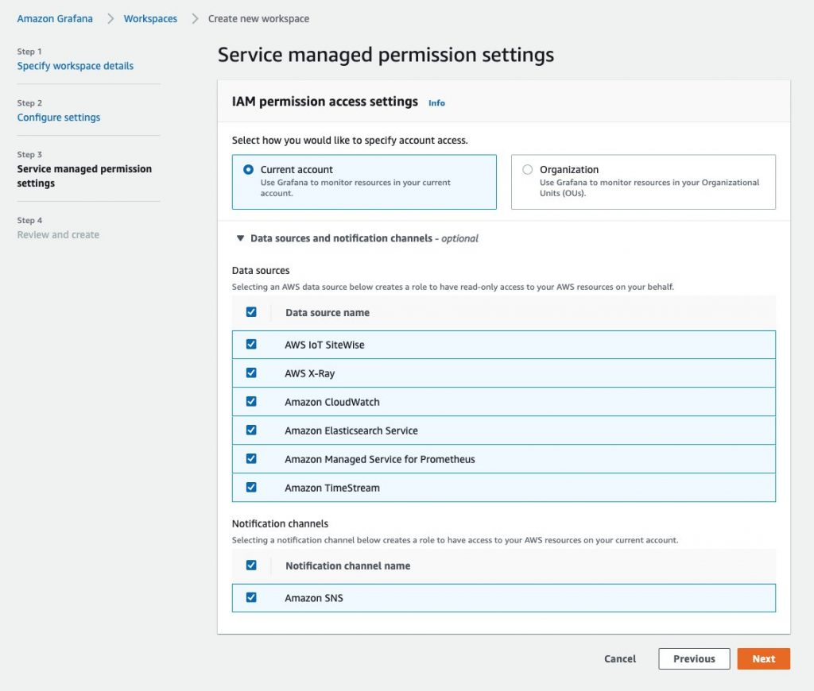
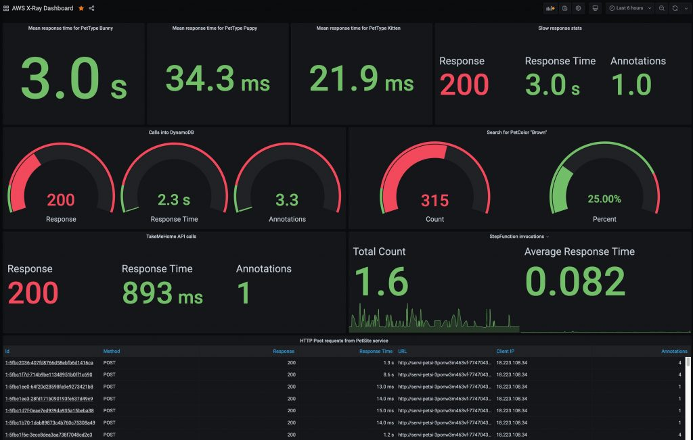

# Using AWS Distro for OpenTelemetry in EKS on Fargate with Amazon Managed Service for Prometheus

In this recipe we show you how to instrument a [sample Go application](https://github.com/aws-observability/aws-otel-community/tree/master/sample-apps/prometheus) and
use [AWS Distro for OpenTelemetry (ADOT)](https://aws.amazon.com/otel) to ingest metrics into
[Amazon Managed Service for Prometheus (AMP)](https://aws.amazon.com/prometheus/) .
Then we're using [Amazon Managed Grafana (AMG)](https://aws.amazon.com/grafana/) to visualize the metrics.

We will be setting up an [Amazon Elastic Kubernetes Service (EKS)](https://aws.amazon.com/eks/)
on [AWS Fargate](https://aws.amazon.com/fargate/) cluster and use an
[Amazon Elastic Container Registry (ECR)](https://aws.amazon.com/ecr/) repository
to demonstrate a complete scenario.

!!! note
    This guide will take approximately 1 hour to complete.

## Infrastructure
In the following section we will be setting up the infrastructure for this recipe. 

### Architecture

The ADOT-AMP pipeline enables us to use the 
[ADOT Collector](https://github.com/aws-observability/aws-otel-collector) to 
scrape a Prometheus-instrumented application, and ingest the scraped metrics to
AMP. 


The ADOT Collector includes two AWS OpenTelemetry Collector components specific 
to Prometheus: the Prometheus Receiver and the AWS Prometheus Remote Write Exporter. 

!!! info 
    For more information on Prometheus Remote Write Exporter check out:
    [Getting Started with Prometheus Remote Write Exporter for AMP](https://aws-otel.github.io/docs/getting-started/prometheus-remote-write-exporter).


### Prerequisites

* The AWS CLI is [installed](https://docs.aws.amazon.com/cli/latest/userguide/cli-chap-install.html) and [configured](https://docs.aws.amazon.com/cli/latest/userguide/cli-chap-configure.html) in your environment.
* You need to install the [eksctl](https://docs.aws.amazon.com/eks/latest/userguide/eksctl.html) command in your environment.
* You need to install [kubectl](https://docs.aws.amazon.com/eks/latest/userguide/install-kubectl.html) in your environment. 
* You have [docker](https://docs.docker.com/get-docker/) installed into your environment.

### Create an EKS on Fargate cluster

Our demo application in this recipe will be running on top of EKS. 
You can either use an existing EKS cluster or create one using [cluster_config.yaml](./fargate-eks-metrics-go-adot-ampamg/cluster-config.yaml).

This template will create a new cluster with EKS on [AWS Fargate](https://aws.amazon.com/fargate/). 

Edit the template file and set your region to one of the available regions for AMP:

* `us-east-1`
* `us-east-2`
* `us-west-2`
* `eu-central-1`
* `eu-west-1`

Make sure to overwrite this region in your session, for example, in Bash:

```
export AWS_DEFAULT_REGION=eu-west-1
```

Create your cluster using the following command:

```
eksctl create cluster -f cluster-config.yaml
```

### Create an ECR repository

In order to deploy our application to EKS we need a container registry. 
You can use the following command to create a new ECR registry in your account. 

```
aws ecr create-repository \
    --repository-name prometheus-sample-app \
    --image-scanning-configuration scanOnPush=true \
    --region eu-west-1
```

### Set up AMP 

First, create an AMP workspace using the AWS CLI with:

```
aws amp create-workspace --alias prometheus-sample-app
```

Verify the workspace is created using:

```
aws amp list-workspaces
```

!!! info
    For more details check out the [AMP Getting started](https://docs.aws.amazon.com/prometheus/latest/userguide/AMP-getting-started.html) guide.


### Set up ADOT Collector 

Download [adot-collector-fargate.yaml](./fargate-eks-metrics-go-adot-ampamg/adot-collector-fargate.yaml) 
and edit this YAML doc with the parameters described in the next steps.

In this example, the ADOT Collector configuration uses an annotation `(scrape=true)` 
to tell which target endpoints to scrape. This allows the ADOT Collector to distinguish 
the sample app endpoint from kube-system endpoints in your cluster.
You can remove this from the re-label configurations if you want to scrape a different sample app. 

Use the following steps to edit the downloaded file for your environment:

1\. Replace `<REGION>` with your current region. 

2\. Replace `<YOUR_ENDPOINT>` with the remote write URL of your workspace.

Get your AMP remote write URL endpoint by executing the following queries. 

First, get the workspace ID like so:

```
YOUR_WORKSPACE_ID=$(aws amp list-workspaces \
                    --alias prometheus-sample-app \
                    --query 'workspaces[0].workspaceId' --output text)
```

Now get the remote write URL endpoint URL for your workspace using:

```
YOUR_ENDPOINT=$(aws amp describe-workspace \
                --workspace-id $YOUR_WORKSPACE_ID  \
                --query 'workspace.prometheusEndpoint' --output text)api/v1/remote_write
```

!!! warning
    Make sure that `YOUR_ENDPOINT` is in fact the remote write URL, that is, 
    the URL should end in `/api/v1/remote_write`.

3\. Finally replace your `<YOUR_ACCOUNT_ID>`  with your current account ID.

The following command will return the account ID for the current session:

```
aws sts get-caller-identity --query Account --output text
```

After creating deployment file we can now apply this to our cluster by using the following command: 

```
kubectl apply -f adot-collector-fargate.yaml
```

!!! info
    For more information check out the [AWS Distro for OpenTelemetry (ADOT) 
    Collector Setup](https://aws-otel.github.io/docs/getting-started/prometheus-remote-write-exporter/eks#aws-distro-for-opentelemetry-adot-collector-setup).

### Set up AMG

Set up a new AMG workspace using the 
[Amazon Managed Grafana – Getting Started](https://aws.amazon.com/blogs/mt/amazon-managed-grafana-getting-started/) guide.

Make sure to add "Amazon Managed Service for Prometheus" as a datasource during creation.



## Application

In this recipe we will be using a
[sample application](https://github.com/aws-observability/aws-otel-community/tree/master/sample-apps/prometheus) 
from the AWS Observability repository.

This Prometheus sample app generates all four Prometheus metric types 
(counter, gauge, histogram, summary) and exposes them at the `/metrics` endpoint.

### Build container image

To build the container image, first clone the Git repository and change
into the directory as follows:

```
git clone https://github.com/aws-observability/aws-otel-community.git && \
cd ./aws-otel-community/sample-apps/prometheus
```

First, set the region and account ID to what is applicable in your case. For
example, in the Bash shell this would look as follows:

```
export REGION="eu-west-1"
export ACCOUNTID=`aws sts get-caller-identity --query Account --output text`
```

Next, build the container image:

```
docker build . -t "$ACCOUNTID.dkr.ecr.$REGION.amazonaws.com/prometheus-sample-app:latest"
```

!!! note
    If `go mod` fails in your environment due to a proxy.golang.or i/o timeout,
    you are able to bypass the go mod proxy by editing the Dockerfile.

    Change the following line in the Docker file:
    ```
    RUN GO111MODULE=on go mod download
    ```
    to:
    ```
    RUN GOPROXY=direct GO111MODULE=on go mod download
    ```

Now you can push the container image to the ECR repo you created earlier on.

For that, first log in to the default ECR registry:

```
aws ecr get-login-password --region $REGION | \
    docker login --username AWS --password-stdin \
    "$ACCOUNTID.dkr.ecr.$REGION.amazonaws.com"
```

And finally, push the container image to the ECR repository you created, above:

```
docker push "$ACCOUNTID.dkr.ecr.$REGION.amazonaws.com/prometheus-sample-app:latest"
```

### Deploy sample app

Edit [prometheus-sample-app.yaml](./fargate-eks-metrics-go-adot-ampamg/prometheus-sample-app.yaml)
to contain your ECR image path. That is, replace `ACCOUNTID` and `REGION` in the
file with your own values:

``` 
    # change the following to your container image:
    image: "ACCOUNTID.dkr.ecr.REGION.amazonaws.com/prometheus-sample-app:latest"
```

Now you can deploy the sample app to your cluster using:

```
kubectl apply -f prometheus-sample-app.yaml
```

## End-to-end

Now that you have the infrastructure and the application in place, we will
test out the setup, sending metrics from the Go app running in EKS to AMP and
visualize it in AMG.

### Verify your pipeline is working 

Enter the following command to and note down the name of the collector pod:

```
kubectl -n adot-col get pods 
```

You should be able to see a adot-collector pod in the running state:
```
NAME                              READY   STATUS    RESTARTS   AGE
adot-collector-5f7448f6f6-cj7j8   1/1     Running   0          1h
```

Our example template is already integrated with the logging exporter. Enter the following command:

```
kubectl -n adot-col logs adot-collector
```

From  of the scraped metrics from the sample app will look like the following example: 
```
Resource labels:
     -> service.name: STRING(kubernetes-service-endpoints)
     -> host.name: STRING(192.168.16.238)
     -> port: STRING(8080)
     -> scheme: STRING(http)
InstrumentationLibraryMetrics #0
Metric #0
Descriptor:
     -> Name: test_gauge0
     -> Description: This is my gauge
     -> Unit: 
     -> DataType: DoubleGauge
DoubleDataPoints #0
StartTime: 0
Timestamp: 1606511460471000000
Value: 0.000000
```

To test whether AMP received the metrics, use [awscurl](https://github.com/okigan/awscurl). This tool enables you to send HTTP requests through the command line with AWS Sigv4 authentication, so you must have AWS credentials set up locally with the correct permissions to query from AMP.

In the following command, and replace `$AMP_ENDPOINT` with the endpoint for your AMP workspace. 

```
awscurl --service="aps" \ 
    --region="$REGION" "https://$AMP_ENDPOINT/api/v1/query?query=adot_test_gauge0" \
        {"status":"success","data":{"resultType":"vector","result":[{"metric":{"__name__":"adot_test_gauge0"},"value":[1606512592.493,"16.87214000011479"]}]}}
```

### Create a Grafana dashboard in AMG

Use the following guides to create your first dashboard:

* [User Guide: Dashboards](https://docs.aws.amazon.com/grafana/latest/userguide/dashboard-overview.html)
* [Best practices for creating dashboards](https://grafana.com/docs/grafana/latest/best-practices/best-practices-for-creating-dashboards/)

For example, the dashboard could look as follows:



## Cleanup

1. Remove the resources and cluster
```
kubectl delete all --all
eksctl delete cluster --name amp-eks-fargate
```
2. Remove the AMP workspace
```
aws amp delete-workspace --workspace-id `aws amp list-workspaces --alias prometheus-sample-app --query 'workspaces[0].workspaceId' --output text`
```
3. Remove the amp-iamproxy-ingest-role IAM role 
```
aws delete-role --role-name amp-iamproxy-ingest-role
```
4. Remove the AMG workspace by removing it from the console. 
